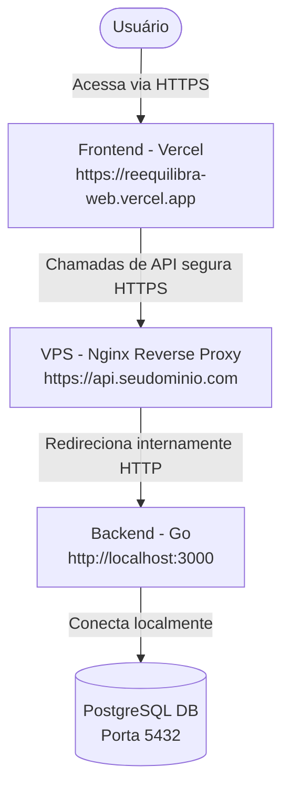

# 🚀 Guia de Deploy - Reequilibra CRM

Este guia contém o passo a passo completo para colocar o **Backend (Go) na VPS** e o **Frontend (React/Vite) na Vercel**, garantindo uma comunicação segura e em conformidade com as regras de navegadores modernos.

---

## 🏛️ Visão Geral da Arquitetura em Produção



> [!IMPORTANT]
> **Alerta de Segurança (HTTPS Obrigatório):**
> Como a Vercel hospeda o frontend sob **HTTPS** por padrão, o navegador dos usuários bloqueará qualquer requisição para a VPS feita por **HTTP simples** (erro de *Mixed Content*). Portanto, é obrigatório expor a API em Go usando HTTPS na VPS (o que faremos usando Nginx + Certbot/Let's Encrypt gratuito).

---

## 1. Deploy do Backend (Go) na VPS

### Passo 1.1: Preparar o executável (Build do Go)
Para rodar na VPS (geralmente Linux), você deve compilar o projeto Go especificamente para a arquitetura do servidor.

Se você estiver compilando no seu computador (Linux) e a VPS for Linux de mesma arquitetura (64-bit), rode na pasta `reequilibra-api`:
```bash
go build -o reequilibra-api-prod cmd/api/main.go
```
*(Se estiver em outro sistema como Windows/Mac, use `GOOS=linux GOARCH=amd64 go build -o reequilibra-api-prod cmd/api/main.go`)*.

### Passo 1.2: Transferir os arquivos para a VPS
Envie o binário compilado `reequilibra-api-prod` e o arquivo `.env` para a sua VPS usando SCP ou SFTP:
```bash
scp reequilibra-api-prod usuario@IP_DA_SUA_VPS:/var/www/reequilibra-api/
```

### Passo 1.3: Configurar o arquivo `.env` na VPS
Na VPS, crie um arquivo `.env` na mesma pasta do executável `/var/www/reequilibra-api/.env` com as configurações de produção:

```env
JWT_SECRET=coloque_aqui_uma_chave_longa_e_super_segura
DATABASE_URL=host=127.0.0.1 user=postgres password=SUA_SENHA_AQUI dbname=reequilibra port=5432 sslmode=disable
ADMIN_PASSWORD=admin_seguro_producao
PORT=3000
```
*(Nota: Como o banco Postgres já está na VPS, use `host=127.0.0.1` para maior velocidade e segurança).*

### Passo 1.4: Criar o Serviço no Linux (Systemd)
Para garantir que a API Go inicie sozinha se a VPS reiniciar e rode em segundo plano de forma estável, crie um serviço do Linux:

1. Conecte-se na VPS via SSH.
2. Crie o arquivo de serviço:
   ```bash
   sudo nano /etc/systemd/system/reequilibra-api.service
   ```
3. Cole o conteúdo abaixo:
   ```ini
   [Unit]
   Description=Reequilibra CRM Go API
   After=network.target postgresql.service

   [Service]
   Type=simple
   User=root
   WorkingDirectory=/var/www/reequilibra-api
   ExecStart=/var/www/reequilibra-api/reequilibra-api-prod
   Restart=always
   RestartSec=5
   Environment=PORT=3000

   [Install]
   WantedBy=multi-user.target
   ```
4. Salve e saia (Ctrl+O, Enter, Ctrl+X).
5. Ative e inicie o serviço:
   ```bash
   sudo systemctl daemon-reload
   sudo systemctl enable reequilibra-api
   sudo systemctl start reequilibra-api
   ```
6. Verifique se está rodando:
   ```bash
   sudo systemctl status reequilibra-api
   ```

---

## 2. Configurar o Proxy Reverso HTTPS com Nginx na VPS

Para expor a API de forma segura (`https://api.seudominio.com`):

### Passo 2.1: Apontamento de DNS
No painel onde você comprou seu domínio (ex: Registro.br, Cloudflare, etc.), crie um registro do tipo **A**:
* **Nome/Subdomínio:** `api`
* **Destino/IP:** `O IP da sua VPS`

### Passo 2.2: Instalar e configurar o Nginx
Na sua VPS, instale o Nginx:
```bash
sudo apt update
sudo apt install nginx -y
```

Crie um arquivo de configuração para a API:
```bash
sudo nano /etc/nginx/sites-available/reequilibra-api
```

Cole a configuração abaixo (substitua `api.seudominio.com` pelo seu domínio real):
```nginx
server {
    listen 80;
    server_name api.seudominio.com;

    location / {
        proxy_pass http://127.0.0.1:3000;
        proxy_http_version 1.1;
        proxy_set_header Upgrade $http_upgrade;
        proxy_set_header Connection 'upgrade';
        proxy_set_header Host $host;
        proxy_cache_bypass $http_upgrade;
        proxy_set_header X-Real-IP $remote_addr;
        proxy_set_header X-Forwarded-For $proxy_add_x_forwarded_for;
        proxy_set_header X-Forwarded-Proto $scheme;
    }
}
```

Ative o site e reinicie o Nginx:
```bash
sudo ln -s /etc/nginx/sites-available/reequilibra-api /etc/nginx/sites-enabled/
sudo nginx -t
sudo systemctl restart nginx
```

### Passo 2.3: Instalar o SSL gratuito (Let's Encrypt)
Instale o Certbot para configurar o HTTPS automaticamente:
```bash
sudo apt install certbot python3-certbot-nginx -y
sudo certbot --nginx -d api.seudominio.com
```
*Siga as instruções na tela e escolha a opção de **redirecionar todo o tráfego HTTP para HTTPS**.*

Pronto! Sua API Go agora está online e protegida em `https://api.seudominio.com`.

---

## 3. Deploy do Frontend (React/Vite) na Vercel

### Passo 3.1: Conectar o GitHub à Vercel
1. Acesse o site da [Vercel](https://vercel.com/) e faça login com seu GitHub.
2. Clique em **Add New...** ➔ **Project**.
3. Importe o seu repositório `reequilibra-web`.

### Passo 3.2: Configurar Variáveis de Ambiente
Na tela de importação, antes de clicar em Deploy, expanda a seção **Environment Variables** e adicione:

* **Key:** `VITE_API_URL`
* **Value:** `https://api.seudominio.com` *(a URL segura da sua API na VPS)*

### Passo 3.3: Ajustes de Configuração do Build
* **Framework Preset:** Selecione `Vite` (ele detecta automaticamente).
* **Build Command:** `npm run build` ou `vite build`
* **Output Directory:** `dist`

Clique em **Deploy**! Em menos de 2 minutos seu frontend estará online mundialmente em um endereço HTTPS super rápido fornecido pela Vercel.

---

## 🔁 Fluxo de Atualização (CI/CD)
* **Frontend:** Toda vez que você fizer um `git push origin master` no seu repositório do frontend, a Vercel detecta e atualiza o site no ar de forma 100% automática.
* **Backend:** Para atualizar o Go, basta rodar o comando de `go build` no seu PC, enviar o novo binário para a pasta `/var/www/reequilibra-api` na VPS e rodar `sudo systemctl restart reequilibra-api`.
